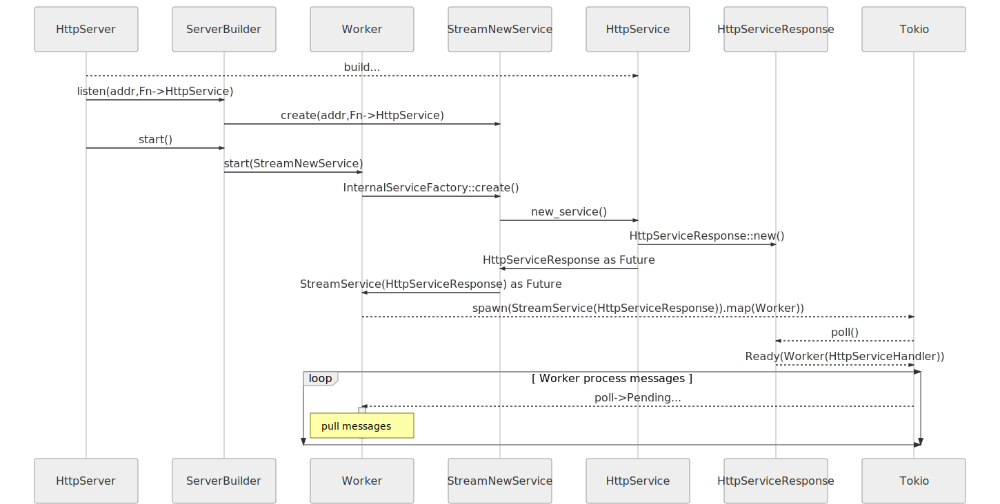

## Auto-Reloading Development Server

```bash
# cargo install cargo-watch
cargo watch -x run
```

## Architecture



## References

https://github.com/actix/examples/blob/master/basics/basics/README.md

```bash
sudo apt-get install pkg-config libssl-dev
export PKG_CONFIG_PATH="/usr/local/opt/openssl@1.1/lib/pkgconfig"
```
